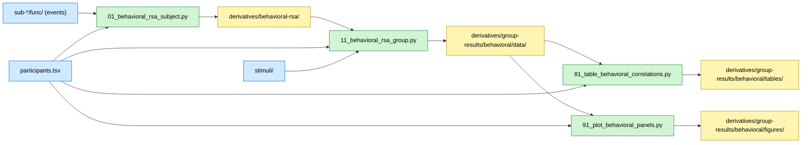

# Behavioral Representational Similarity Analysis (RSA)

## Overview

This analysis examines behavioral similarity judgments from a 1-back preference task performed during fMRI scanning. Participants (20 experts, 20 novices) indicated which of two consecutively presented chess boards they preferred. We test whether behavioral preferences correlate with theoretical models of chess board similarity.

## Required bundles

- `01_behavioral_rsa_subject.py` needs **A** (core: BIDS events, stimuli, participants) and writes per-subject preference RDMs into `derivatives/behavioral-rsa/` (bundle E).
- `11_behavioral_rsa_group.py` reads those per-subject RDMs from bundle E and writes group aggregates (correlations, FDR-corrected stats, group mean RDMs, DSMs) into `derivatives/group-results/behavioral/data/`.
- `81_table_behavioral_correlations.py` and `91_plot_behavioral_panels.py` only consume outputs of `11_behavioral_rsa_group.py` from the group-results derivative folder.

## Data flow



## Methods

### Task and Data

During fMRI scanning, participants viewed 40 chess board stimuli (20 checkmate positions, 20 non-checkmate positions) presented sequentially in a 1-back task. On each trial, participants indicated which of the two most recent boards they preferred by button press. Preference responses were recorded in BIDS-compliant `events.tsv` files.

### Behavioral RDM Construction

Pairwise preferences were aggregated across participants within each expertise group. For each unique stimulus pair (i, j), we counted the number of times stimulus i was preferred over j and vice versa. The behavioral representational dissimilarity matrix (RDM) was computed as the absolute difference between these counts:

```
RDM[i,j] = |count(i > j) - count(j > i)|
```

Higher values indicate greater inconsistency in preferences (stimuli are dissimilar in how they are perceived). Lower values indicate consistent preferences (stimuli are treated similarly).

### Count-Normalized RDM (primary analysis)

Because the 1-back task compares only consecutive boards, different stimulus pairs are compared different numbers of times depending on the random presentation sequence. Pairs compared more often accumulate higher raw counts, inflating their RDM values independently of preference consistency. To control for this exposure confound, the primary analysis uses count-normalized RDMs:

```
RDM_norm[i,j] = |count(i > j) - count(j > i)| / (count(i > j) + count(j > i))
```

Values range from 0 (perfectly tied preferences) to 1 (perfectly consistent preference direction). Pairs with zero comparisons are set to 0. The same normalization is applied to the directional preference matrix (DSM).

The unnormalized (raw count) RDM is also computed and reported as a supplementary panel for comparison. The normalization does not change the qualitative pattern of results but provides a more interpretable dissimilarity metric that is not confounded with pair exposure frequency.

### Model RDMs

Three theoretical model RDMs were constructed:

1. **Checkmate status**: Binary RDM (0 if same status, 1 if different)
2. **Strategy type**: Categorical RDM based on 5 chess strategies
3. **Visual similarity**: Perceptual feature-based dissimilarity

### Statistical Analysis

Behavioral RDMs were correlated with each model RDM using Pearson correlation. Significance was assessed via bootstrap resampling (10,000 iterations; `pingouin`). False discovery rate (FDR) correction was applied separately within each group (family size = 3 models per group) using the Benjamini–Hochberg procedure (α=0.05).

Separate analyses were conducted for experts and novices to test whether expertise modulates the cognitive dimensions underlying preference judgments.

### Visualization

Multidimensional scaling (MDS) was used to project the 40×40 RDM into 2D space for visualization, preserving pairwise dissimilarities as closely as possible.

## Dependencies

- Python 3.8+
- numpy, pandas, scipy
- scikit-learn (for MDS)
- pingouin (for bootstrap correlations)
- matplotlib, seaborn (for plotting)
- BIDS-compliant event files in `data/BIDS/{participant_id}/func/`

See `requirements.txt` in the repository root for complete dependencies.

## Data Requirements

### Input Files

- **Participant data**: `BIDS/participants.tsv` (columns: `participant_id`, `group`)
- **Event files**: `BIDS/sub-*/func/sub-*_task-exp_run-*_events.tsv`
 - Required columns: `stim_id`, `preference` (`current_preferred`, `previous_preferred`, or `n/a`)
- **Stimulus metadata**: `stimuli/stimuli.tsv`
 - Required columns: `stim_id`, `check`, `strategy`, `visual`

### Data Location

Set the external data root once in `common/constants.py` (all analysis paths are derived from it):

```python
# Base folder containing BIDS/ (all data lives inside BIDS/)
_EXTERNAL_DATA_ROOT = Path("/path/to/manuscript-data")
# BIDS_ROOT, ROI, and other paths are built from this automatically
```

Expected structure under this folder:

```
/path/to/manuscript-data/
└── BIDS/ # Main dataset (BIDS-compliant)
 ├── participants.tsv
 ├── stimuli/ # Stimulus metadata
 ├── sub-*/
 └── derivatives/ # Per-subject derivatives + atlases
```

## Running the Analysis

### Step 1: Per-subject preference RDMs

```bash
# From repository root (recommended)
python chess-behavioral/01_behavioral_rsa_subject.py
```

**Outputs** (saved to `BIDS/derivatives/behavioral-rsa/sub-*/`):
- `sub-XX_desc-preference_rdm.tsv`: Count-normalized preference RDM (40×40) per subject.
- `sub-XX_desc-preference_rdm.json`: Sidecar describing the matrix, units, and source events.

### Step 2: Group aggregation

```bash
python chess-behavioral/11_behavioral_rsa_group.py
```

**Outputs** (saved to `derivatives/group-results/behavioral/data/`):
- `expert_behavioral_rdm.npy` / `novice_behavioral_rdm.npy`: count-normalized group RDMs (40×40)
- `expert_behavioral_rdm_raw.npy` / `novice_behavioral_rdm_raw.npy`: raw-count variants
- `expert_directional_dsm.npy` / `novice_directional_dsm.npy`: normalized directional preference matrices
- `expert_directional_dsm_raw.npy` / `novice_directional_dsm_raw.npy`: raw-count directional matrices
- `expert_mds_coords.npy` / `novice_mds_coords.npy`: MDS 2D embeddings
- `correlation_results.pkl`: RSA correlation statistics with FDR correction
- `correlation_summary.csv`: Human-readable summary table

### Step 3: Generate Tables

```bash
python chess-behavioral/81_table_behavioral_correlations.py
```

**Outputs** (saved to `derivatives/group-results/behavioral/tables/`):
- `behavioral_rsa_correlations.tex`: LaTeX table
- `behavioral_rsa_correlations.csv`: CSV table

### Step 4: Generate Figures

```bash
python chess-behavioral/91_plot_behavioral_panels.py
```

**Outputs** (saved to `derivatives/group-results/behavioral/figures/`):
- Individual axes as SVG/PDF: `behavioral_A1_RDM_Experts.svg`, etc.
- Complete panel: `panels/behavioral_rsa_panel.pdf` (raw directional DSMs + count-normalized RDMs + MDS + correlation bars)

**Note**: If `ENABLE_PYLUSTRATOR=True` in `common/constants.py`, this will open an interactive layout editor. Set to `False` for automated figure generation.

## Key Results

**Experts**: Behavioral preferences correlate significantly with:
- Checkmate status (Pearson r = 0.73, pFDR < 0.001)
- Strategy type (Pearson r = 0.25, pFDR < 0.001)
- Visual similarity (Pearson r = −0.12, pFDR = 0.001)

Values are from the count-normalized RDM (primary analysis). Raw-count RDM correlations are similar (r = 0.70, 0.24, −0.10 respectively).

**Novices**: No significant correlations with any model RDM (all pFDR > 0.14).

The count-normalized analysis produces comparable results, confirming that the model fits are not driven by differential pair exposure.

This demonstrates that chess expertise shapes behavioral similarity judgments along task-relevant dimensions (checkmate status, strategic content) but not low-level visual features.

## File Structure

```
chess-behavioral/
├── README.md # This file
├── 01_behavioral_rsa_subject.py # Subject-level: per-subject preference RDMs → BIDS derivatives/
├── 11_behavioral_rsa_group.py # Group-level: aggregate + stats → derivatives/group-results/behavioral/data/
├── 81_table_behavioral_correlations.py # LaTeX/CSV table generation
└── 91_plot_behavioral_panels.py # Figure generation

BIDS/derivatives/behavioral-rsa/ # Per-subject derivatives (bundle E)
└── sub-*/sub-*_desc-preference_rdm.{tsv,json}

analyses/behavioral/ # Shared analysis modules (repo root analyses/ package)
├── data_loading.py # BIDS data loaders
└── rdm_utils.py # RDM / DSM computation and RSA

derivatives/group-results/behavioral/ # Unified repo results tree (not committed)
├── data/ # *.npy, *.pkl, *.csv numerical results
├── tables/ # LaTeX tables
└── figures/ # Publication figures
```

Group-level outputs are stored in `BIDS/derivatives/group-results/`.

