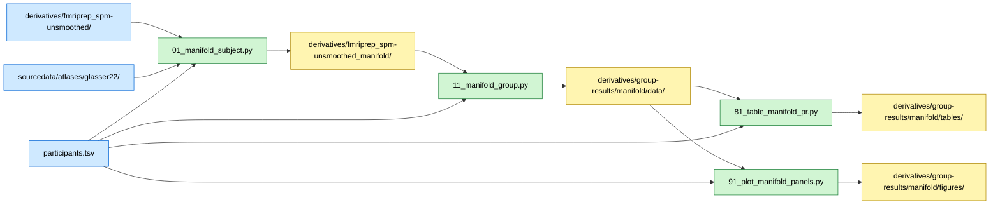

# Participation Ratio (PR) Manifold Dimensionality Analysis

## Overview

This analysis quantifies the effective dimensionality of neural representations in chess-related brain regions using the participation ratio (PR) metric. We hypothesize that chess expertise alters the dimensionality of multivoxel representations—specifically, that experts may show more compressed or structured representational geometries compared to novices. PR values are computed per subject per ROI, compared between groups, and used to classify expertise level.

## Required bundles

- `01_manifold_subject.py` reads SPM unsmoothed beta images and the Glasser-22 atlas → needs **A** (core) + **D** (spm). Writes per-subject PR values into `derivatives/fmriprep_spm-unsmoothed_manifold/` (bundle E).
- `11_manifold_group.py` reads those per-subject PR values from bundle E and writes group aggregates into `derivatives/group-results/manifold/data/`.
- `81_table_manifold_pr.py` and `91_plot_manifold_panels.py` only consume the outputs of `11_manifold_group.py` from the group-results derivative folder.

## Data flow



## Methods

### Rationale

Neural population activity can be conceptualized as trajectories in a high-dimensional state space. The participation ratio (PR) quantifies the effective dimensionality of these representations—how many dimensions are actively used versus how concentrated activity is along a few dominant axes. Higher PR values indicate that variance is more evenly distributed across principal components, reflecting a higher-dimensional, less compressed representational space.

### Data Sources

Trial-wise beta estimates were extracted from unsmoothed first-level GLMs for each of 40 participants (20 experts, 20 novices) across 40 chess stimuli (20 checkmate positions, 20 non-checkmate positions). Beta values were extracted from 22 bilateral cortical regions defined by the Glasser multimodal parcellation. Each ROI's beta matrix has shape (n_stimuli × n_voxels).

**Atlas**: Glasser multimodal parcellation (22 bilateral regions selected for chess-related processing)
**GLM**: SPM12 first-level unsmoothed beta estimates, averaged within each unique chess board condition

### Participation Ratio Computation

For each participant and each ROI, we computed the participation ratio from the beta matrix B (40 stimuli × n_voxels):

1. Center B by subtracting the mean across stimuli for each voxel
2. Exclude any voxels with zero variance across conditions
3. Perform principal component analysis (PCA) on the centered matrix
4. Extract eigenvalues λ_i from the PCA decomposition
5. Compute PR using the formula:

```
PR = (Σ λ_i)² / Σ (λ_i²)
```

PR ranges from 1 (activity concentrated along one dimension) to n_voxels (activity uniformly distributed across all dimensions). Higher PR indicates more distributed, higher-dimensional representations.

### Group-Level Statistical Testing

PR values were grouped by expertise (experts vs novices) for each ROI. Three statistical tests were conducted:

1. **Welch two-sample t-test**: Comparing expert and novice mean PR values for each ROI
 - Null hypothesis: μ_expert = μ_novice
 - Implementation: `scipy.stats.ttest_ind` with `equal_var=False` (allows unequal variances)
 - Two-tailed tests

2. **False Discovery Rate (FDR) correction**: Applied across 22 ROIs using the Benjamini-Hochberg procedure (α=0.05)
 - Implementation: `statsmodels.stats.multitest.multipletests` with `method='fdr_bh'`

3. **Effect size**: Cohen's d computed as (mean_expert − mean_novice) / pooled_std

### Classification Analysis

To assess whether PR profiles distinguish experts from novices, we trained a logistic regression classifier on the 22-dimensional PR feature space (one feature per ROI).

**Training procedure**:
- Features standardized (z-scored) before training
- Stratified K-fold cross-validation with up to 5 folds (limited by group sizes) to estimate accuracy
- Logistic regression with default regularization

**Permutation test for significance**:
- 10,000 permutation iterations with randomly shuffled group labels
- P-value = proportion of permuted accuracies ≥ observed accuracy
- Tests whether classification accuracy exceeds chance level

**Two classification spaces tested**:
1. Full 22-dimensional ROI space (all PR features)
2. 2D PCA space (testing if even low-dimensional projection is informative)

### Dimensionality Reduction and Visualization

Principal component analysis (PCA) was performed on the standardized 22-dimensional PR features to enable 2D visualization. The first two principal components (PC1, PC2) captured the largest sources of variance in PR profiles. A logistic regression decision boundary was fitted in the 2D PCA space to visualize the linear separability of expert and novice PR profiles.

## Data Requirements

### Input Files

- **Atlas**: `rois/glasser22/tpl-MNI152NLin2009cAsym_res-02_atlas-Glasser2016_desc-22_bilateral_resampled.nii.gz`
 - 3D volume with integer labels for 22 bilateral cortical regions
- **ROI metadata**: `rois/glasser22/region_info.tsv`
 - Columns: `roi_id`, `roi_name`, `hemisphere`
- **Participant data**: `BIDS/participants.tsv`
 - Columns: `participant_id`, `group` (expert/novice)
- **Beta images**: `BIDS/derivatives/fmriprep_spm-unsmoothed/sub-*/exp/beta_*.nii.gz`
 - Trial-wise beta estimates from SPM12 first-level GLMs (unsmoothed)
 - One beta image per stimulus per run

### Data Location

Set the external data root once in `common/constants.py` (all analysis paths are derived from it):

```python
# Base folder containing BIDS/ (all data lives inside BIDS/)
_EXTERNAL_DATA_ROOT = Path("/path/to/manuscript-data")
# BIDS_ROOT and ROI paths are built automatically from this
```

Additional paths (derived from the external data root) used here:
- `ROI_GLASSER_22_ATLAS`: Path to atlas NIfTI file
- `ROI_GLASSER_22`: Path to ROI metadata directory
- `SPM_GLM_UNSMOOTHED`: Path to unsmoothed GLM directory

## Running the Analysis

### Step 1: Per-subject PR values

```bash
# From repository root
cd chess-manifold
python 01_manifold_subject.py
```

**Outputs** (saved to `BIDS/derivatives/fmriprep_spm-unsmoothed_manifold/sub-*/`):
- `sub-XX_space-MNI152NLin2009cAsym_roi-glasser_desc-pr_values.tsv`: Per-ROI PR values for the subject.
- Matching sidecar JSON describing the statistic, atlas, and source.

### Step 2: Group aggregation

```bash
python 11_manifold_group.py
```

**Outputs** (saved to `derivatives/group-results/manifold/data/`):
- `pr_results.pkl`: Group-level results dictionary (summary statistics, classification results; no longer contains `pr_long_format`, `participants`, or `pr_matrix['matrix']` -- those per-subject fields now live in `derivatives/`)
- `pr_summary_stats.csv`: Group means, standard errors, and 95% CIs per ROI
- `pr_statistical_tests.csv`: Welch t-tests, FDR-corrected q-values, Cohen's d per ROI
- `pr_classification_tests.csv`: Classification accuracy and permutation p-values for ROI and PCA-2D spaces

### Step 3: Generate Tables

```bash
python chess-manifold/81_table_manifold_pr.py
```

**Outputs** (saved to `derivatives/group-results/manifold/tables/`):
- `manifold_pr_results.tex`: LaTeX table with group statistics and t-test results
- `manifold_pr_results.csv`: CSV version of the table

### Step 4: Generate Figures

```bash
python chess-manifold/91_plot_manifold_panels.py
```

**Outputs** (saved to `derivatives/group-results/manifold/figures/`):
- Individual axes as SVG:
 - `manifold_bars__Bars_Top_Mean_PR.svg`
 - `manifold_bars__Bars_Bottom_Diff_PR.svg`
 - `manifold_bars__ROI_Groups_Legend.svg`
 - `manifold_matrix_pca__A_PR_Matrix.svg`
 - `manifold_matrix_pca__B_PCA_Projection.svg`
 - `manifold_matrix_pca__C_Feature_Importance.svg`
 - `manifold_matrix_pca__D_PCA_Loadings.svg`
 - `manifold_pr_voxels__E_PR_vs_Voxels_Experts.svg`
 - `manifold_pr_voxels__F_PR_vs_Voxels_Novices.svg`
 - `manifold_pr_voxels__G_PRdiff_vs_VoxelsAvg.svg`
- Complete panel PDFs:
 - `panels/manifold_bars_panel.pdf`
 - `panels/manifold_matrix_pca_panel.pdf`
 - `panels/manifold_pr_voxels_panel.pdf`

**Note**: If `ENABLE_PYLUSTRATOR=True` in `common/constants.py`, this will open an interactive layout editor. Set to `False` for automated figure generation.

## Key Results

**Group Differences**:
- Several ROIs show significant expertise-related differences in PR after FDR correction
- Effect sizes (Cohen's d) range from small to medium across significant ROIs

**Classification**:
- 5-fold stratified CV accuracy in full 22D ROI space: 82.5% (permutation p = 0.0002)
- 2D PCA space also shows above-chance classification: 80.0% (permutation p = 0.0003)
- Both spaces support robust expert-vs-novice separation from PR profiles

**Interpretation**:
- Expert and novice groups differ in the effective dimensionality of neural representations in task-relevant regions
- PR profiles can classify expertise level above chance, suggesting systematic differences in representational geometry
- Specific ROIs contribute more strongly to group classification (visualized via classifier weights)

## File Structure

```
chess-manifold/
├── README.md # This file
├── 01_manifold_subject.py # Subject-level: per-subject PR → BIDS derivatives/
├── 11_manifold_group.py # Group-level: aggregate + stats → derivatives/group-results/manifold/data/
├── 81_table_manifold_pr.py # LaTeX/CSV table generation
├── 91_plot_manifold_panels.py # Figure generation
├── METHODS.md # Detailed methods from manuscript
├── RESULTS.md # Detailed results summary
├── DISCREPANCIES.md # Notes on analysis discrepancies
└── analyses/manifold/ # Shared analysis modules (in repo root analyses/ package)
 ├── __init__.py
 ├── analysis.py # Group comparison and FDR correction
 ├── data.py # Data loading and reshaping utilities
 ├── models.py # Classification, PCA, permutation tests
 ├── pr_computation.py # Core PR computation from beta images
 ├── plotting.py # Plotting utilities
 ├── tables.py # Table formatting
 └── utils.py # General utilities

derivatives/group-results/manifold/ # Unified results tree (not committed)
├── data/ # *.pkl, *.csv numerical results
├── tables/ # LaTeX tables
└── figures/ # Publication figures
```

Group-level outputs are stored in `BIDS/derivatives/group-results/`.
