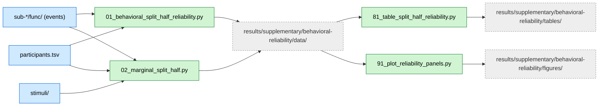

# Split-Half Reliability Analysis of Behavioral RDMs

## Overview

This analysis assesses the internal consistency of behavioral representational dissimilarity matrices (RDMs) using split-half reliability with Spearman-Brown correction. We quantify uncertainty using non-parametric bootstrap across random participant splits to test whether expert and novice groups show reliable and distinct similarity structures in their preference judgments.

## Required bundles

- `01_behavioral_split_half_reliability.py` and `02_marginal_split_half.py` read BIDS events, stimuli, and participants directly → needs **A** (core) only.
- `81_table_split_half_reliability.py` and `91_plot_reliability_panels.py` only consume the outputs of 01/02 from the repo `results/` tree (no extra bundle).

## Data flow



## Methods

### Rationale

Representational similarity analysis requires reliable measurements of similarity structure. Split-half reliability quantifies how consistent the RDM structure is when computed from different subsets of participants within a group. Higher reliability indicates more consistent shared representations across individuals.

### Data Sources

**Participants**: N=40 (20 experts, 20 novices)
**Task**: 1-back preference task during fMRI scanning
**Data**: Pairwise preference judgments between 40 chess board stimuli

### Split-Half Procedure

For each participant group (experts, novices) separately:

1. **Participant Splitting**: Randomly split participants within each group into two halves (n=10 per half). Repeat for 1,000 random splits to build a sampling distribution.

2. **Half-Sample RDMs**: For each half, aggregate pairwise preference counts and compute a 40×40 behavioral RDM using the same method as the main behavioral RSA analysis.

3. **Split-Half Correlation**: Compute Spearman correlation between the two half RDMs; this is the half-sample reliability r_half.

4. **Spearman-Brown Correction**: Estimate full-sample reliability using the prophecy formula:
   ```
   r_full = (2 × r_half) / (1 + r_half)
   ```
   This corrects for the reduced sample size inherent in split-half designs.

5. **Bootstrap Intervals and p-values**: Using the distribution of r_full across 1,000 random splits:
   - Compute 95% CIs via percentile method (2.5th and 97.5th percentiles)
   - Compute two-sided bootstrap p-value using sign-proportion approach with +1 correction:
     ```
     p_boot = 2 × min{ (#{r_full ≤ 0} + 1) / (n + 1),
                       (#{r_full ≥ 0} + 1) / (n + 1) }
     ```

### Between-Group Similarity and Group Difference

**Between-group similarity (Experts vs Novices)**:
- Correlate an expert half-RDM with a novice half-RDM on each iteration
- Apply Spearman-Brown correction
- Report bootstrap CI and p_boot

**Group difference in reliability**:
- Compute bootstrap distribution of Δ = r_full(experts) − r_full(novices) across iterations
- Report percentile 95% CI
- Two-sided bootstrap p-value for Δ vs 0 using sign-proportion rule

### Interpretation Guidelines

Following conventional psychometric guidelines:
- r_full ≥ 0.90: Excellent reliability
- r_full ≥ 0.80: Good reliability
- r_full ≥ 0.70: Acceptable reliability
- r_full < 0.70: Questionable reliability

## Dependencies

- Python 3.8+
- numpy, pandas, scipy
- matplotlib, seaborn (for plotting)
- Reuses `analyses/behavioral/` package for data loading and RDM computation

See `requirements.txt` in the repository root for complete dependencies.

## Data Requirements

### Input Files

Same as `chess-behavioral/` analysis:
- **Participant data**: `data/BIDS/participants.tsv`
- **Event files**: `data/BIDS/sub-*/func/sub-*_task-exp_run-*_events.tsv`
- **Stimulus metadata**: `data/BIDS/stimuli.tsv`

### Data Location

Set the external data root once in `common/constants.py` (all analysis paths are derived from it):

```python
# Base folder containing BIDS/ (all data lives inside BIDS/)
_EXTERNAL_DATA_ROOT = Path("/path/to/manuscript-data")
```

## Running the Analysis

### Step 1: Run Split-Half Reliability Analysis

```bash
# From repository root
python chess-supplementary/behavioral-reliability/01_behavioral_split_half_reliability.py
```

**Outputs** (saved to `results/supplementary/behavioral-reliability/data/`):
- `reliability_metrics.pkl`: Full reliability statistics for table generation
- `reliability_summary.csv`: Human-readable summary (bootstrap CIs and p_boot)
- `split_rdm_distributions.npz`: Bootstrap distributions of r_half and r_full
- `01_behavioral_split_half_reliability.py`: Copy of the analysis script

**Expected runtime**: ~5-10 minutes (1,000 bootstrap iterations)

### Step 2: Generate Tables

```bash
python chess-supplementary/behavioral-reliability/81_table_split_half_reliability.py
```

**Outputs** (saved to `chess-supplementary/behavioral-reliability/results/behavioral_split_half/tables/`):
- `split_half_reliability.tex`: LaTeX table
- `split_half_reliability.csv`: CSV table

## Key Results

**Within-group reliability**:
- **Experts**: Mean Spearman-Brown corrected reliability r = 0.213 (p = 0.004)
- **Novices**: Mean r = 0.043 (p = 0.416, not significant)

**Group difference**:
- Δr = 0.170 (p = 0.034, significant)
- Experts exhibit significantly more consistent split-half reliability than novices

**Between-group similarity**:
- Mean r = -0.004 (p = 0.935)
- Negligible cross-group similarity, indicating expert and novice representations are organized differently

**Interpretation**:
- Expertise is associated with more stable and shared representational geometry
- Experts show consistent pairwise dissimilarity structure across individuals
- Novices show weaker and more idiosyncratic structure
- Near-zero cross-group correlation implies qualitatively different representations, not just strengthened common structure

## File Structure

```
chess-supplementary/behavioral-reliability/
├── README.md                                   # This file
├── 01_behavioral_split_half_reliability.py     # Main split-half analysis
├── 81_table_split_half_reliability.py          # LaTeX/CSV table generation
├── METHODS.md                                  # Detailed methods from manuscript
├── DISCREPANCIES.md                            # Notes on analysis discrepancies
├── analyses/behavioral_reliability/            # Shared analysis modules (in repo root analyses/ package)
│   ├── __init__.py
│   └── split_half_utils.py                     # Split-half and Spearman-Brown utilities
└── results/                                    # Analysis outputs (timestamped)
    └── <timestamp>_behavioral_split_half/
        ├── *.pkl                               # Python objects
        ├── *.csv                               # Summary tables
        ├── *.npz                               # Bootstrap distributions
        └── tables/                             # LaTeX tables
```
