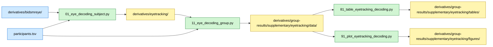

# Eye-Tracking Decoding Analysis

## Overview

This analysis tests whether eye-tracking time-series features discriminate chess experts from novices during the fMRI task. Two feature sets are evaluated independently: (1) two-dimensional gaze coordinates (x, y), and (2) displacement from screen center. Linear support vector machine (SVM) classification is performed with stratified group k-fold cross-validation.

## Required bundles

- `01_eye_decoding_subject.py` reads per-run gaze estimates from `derivatives/bidsmreye/sub-*/func/` and writes per-subject decoding features into `derivatives/eyetracking/` → needs **A** (core) + **E** (analyses).
- `11_eye_decoding_group.py` reads per-subject features from `derivatives/eyetracking/` and writes group aggregates into `derivatives/group-results/supplementary/eyetracking/data/`.
- `81/91` table and plot scripts only consume the outputs of `11` from the group-results derivative folder (no extra bundle).

Note: `bidsmreye/` is populated by the upstream BidsMReye tool, not by this analysis; the chess code only reads it.

## Data flow



## Methods

### Rationale

Eye movements reflect cognitive processes during chess perception and problem-solving. If experts and novices employ different visual strategies, their gaze patterns should be systematically different and decodable from eye-tracking features.

### Data Sources

**Participants**: N=40 (20 experts, 20 novices), 357 total runs
**Data**: BidsMReye gaze-position estimates stored in BIDS format
**Features**:
- **xy**: Two-dimensional gaze coordinates (x_coordinate, y_coordinate)
- **displacement**: Distance from screen center at each timepoint

### Feature Preparation

1. Load all eye-tracking TSV files and corresponding JSON metadata
2. For each feature set (xy, displacement):
 - Truncate runs to common length (minimum number of timepoints across all runs)
 - Flatten each run into a fixed-length feature vector
 - Result: Matrix of runs × features

### Classification Procedure

**Classifier**: Linear SVM with standardization preprocessing
**Cross-validation**: StratifiedGroupKFold (k=20 folds, group=subject)
- Stratification ensures balanced expert/novice representation in each fold
- Grouping ensures all runs from the same subject stay together (prevents data leakage)

**Metrics**:
- Subject-level out-of-fold accuracies, mean accuracy, balanced accuracy, F1 score
- ROC curve and AUC
- 95% confidence interval via Student's t-distribution across subjects
- Fold accuracies and pooled run accuracy reported descriptively

**Statistical test**: One-sample t-test testing whether mean subject-level out-of-fold accuracy differs from chance (0.5)

## Dependencies

- Python 3.8+
- numpy, pandas, scipy
- scikit-learn (for SVM, cross-validation, preprocessing)
- matplotlib, seaborn (for plotting)

See `requirements.txt` in the repository root for complete dependencies.

## Data Requirements

### Input Files

- **Eye-tracking data**: `BIDS/derivatives/bidsmreye/sub-*/func/*_eyetrack.tsv`
- **Metadata**: `BIDS/derivatives/bidsmreye/sub-*/func/*_eyetrack.json`
- **Participant data**: `BIDS/participants.tsv`

### Data Location

Path is derived from `CONFIG['BIDS_EYETRACK']` in `common/constants.py`, which points at `BIDS/derivatives/bidsmreye/`.

## Running the Analysis

### Step 1: Per-subject feature extraction

```bash
# From repository root
python chess-supplementary/eyetracking/01_eye_decoding_subject.py
```

**Outputs** (saved to `BIDS/derivatives/eyetracking/sub-*/`):
- Per-subject decoding feature matrices (gaze coordinates, displacement)

### Step 2: Group-level decoding

```bash
python chess-supplementary/eyetracking/11_eye_decoding_group.py
```

**Outputs** (saved to `derivatives/group-results/supplementary/eyetracking/data/`):
- `results_xy.json`: Metrics and predictions for xy features
- `results_displacement.json`: Metrics and predictions for displacement features
- `fold_accuracies_xy.csv`: Per-fold accuracies for xy
- `fold_accuracies_displacement.csv`: Per-fold accuracies for displacement
- `subject_accuracies_xy.csv`: Per-subject out-of-fold accuracies for xy
- `subject_accuracies_displacement.csv`: Per-subject out-of-fold accuracies for displacement

### Step 3: Tables and figures

```bash
python chess-supplementary/eyetracking/81_table_eyetracking_decoding.py
python chess-supplementary/eyetracking/91_plot_eyetracking_decoding.py
```

- Tables → `derivatives/group-results/supplementary/eyetracking/tables/`
- Figures → `derivatives/group-results/supplementary/eyetracking/figures/`

**Expected runtime**: ~2-5 minutes

## Key Results

Subject-level decoding accuracies indicate whether gaze features systematically differ between experts and novices. Significant above-chance subject-level accuracy would suggest different visual strategies.

## File Structure

```
chess-supplementary/eyetracking/
├── README.md # This file
├── 01_eye_decoding_subject.py # Subject-level: feature extraction → derivatives/eyetracking/
├── 11_eye_decoding_group.py # Group-level: decoding + stats → derivatives/group-results/
├── 81_table_eyetracking_decoding.py # Summary table
├── 91_plot_eyetracking_decoding.py # Summary figure
├── DISCREPANCIES.md # Notes on analysis discrepancies
└── analyses/eyetracking/ # Shared analysis modules (in repo root analyses/ package)
 ├── __init__.py
 ├── io.py # Eye-tracking data loading
 └── features.py # Feature extraction utilities
```

Outputs: per-subject data in `BIDS/derivatives/eyetracking/`; group-level aggregates in `derivatives/group-results/supplementary/eyetracking/{data,tables,figures}/`. The `results/` tree contains **only group-level aggregates** (GDPR-compliant).
