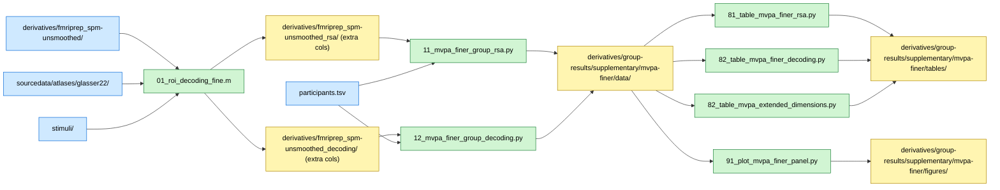

# MVPA Finer Resolution Analysis: Checkmate Boards Only

## Overview

This supplementary analysis extends the main MVPA analysis by performing RSA and SVM decoding with finer categorical distinctions using only the 20 checkmate chess boards. Five additional dimensions are analyzed: Strategy (within checkmate), Motif, Total number of pieces, Total legal moves, and Number of moves to checkmate. This finer analysis assesses what information can be decoded within the checkmate class, offering insights into how strategic information is structured in expert and novice representations.

## Required bundles

- `01_roi_decoding_fine.m` (MATLAB subject script) reads SPM unsmoothed betas from `derivatives/fmriprep_spm-unsmoothed/` and the Glasser-22 atlas from `sourcedata/atlases/glasser22/`; it appends the new `_half` target rows to the same per-subject TSVs under `derivatives/fmriprep_spm-unsmoothed_rsa/` and `derivatives/fmriprep_spm-unsmoothed_decoding/` → needs **A** (core) + **D** (spm).
- `11_mvpa_finer_group_rsa.py` and `12_mvpa_finer_group_decoding.py` read those per-subject TSVs → need **A** (core) + **E** (analyses).
- `81/82/91` table and plot scripts only consume the outputs of `11`/`12` from the group-results derivative folder (no extra bundle).

## Data flow



## Methods

### Rationale

The main MVPA analysis uses all 40 boards. This supplementary analysis focuses on the 20 checkmate boards to examine finer-grained categorical distinctions that are only defined for checkmate positions. This allows testing whether neural representations differentiate between checkmate subtypes based on tactical features, piece counts, and move complexity.

### Data Sources

**Participants**: N=40 (20 experts, 20 novices)
**Stimuli**: 20 checkmate chess boards (subset of main 40-board dataset)
**ROIs**: 22 bilateral cortical regions (Glasser parcellation)

### Categorical Dimensions (Checkmate Boards Only)

1. **Strategy** (`strategy_half`): Same as main analysis, but using only 20 checkmate boards
2. **Motif** (`motif_half`): Tactical motif characterizing the checkmate sequence (e.g., fork, pin, skewer, back-rank mate)
3. **Total pieces** (`total_pieces_half`): Number of pieces on the board
4. **Legal moves** (`legal_moves_half`): Total number of available legal moves
5. **Moves to checkmate** (`check_n_half`): Number of white moves required to reach checkmate

These are the `_half` suffixed targets documented in the root-level sidecar of the `fmriprep_spm-unsmoothed_rsa/` and `fmriprep_spm-unsmoothed_decoding/` derivative folders.

### Subject-Level Analysis (MATLAB/CoSMoMVPA)

**RSA**: Compute neural RDMs from 20 checkmate boards, correlate with model RDMs
**Decoding**: Train linear SVM to classify checkmate boards by each categorical dimension
**Procedure**: Same as main MVPA analysis (`chess-mvpa/`), but restricted to 20 checkmate boards

### Group-Level Analysis (Python)

Same statistical framework as main MVPA:
- Welch t-tests per ROI (experts vs novices)
- One-sample t-tests vs chance/zero
- Benjamini-Hochberg FDR correction across 22 ROIs

## Dependencies

**MATLAB**:
- MATLAB R2024b or later
- CoSMoMVPA toolbox
- SPM12

**Python**:
- Python 3.8+
- numpy, pandas, scipy
- statsmodels (for FDR correction)
- matplotlib, seaborn (for plotting)

See `requirements.txt` in the repository root for complete dependencies.

## Data Requirements

### Input Files

Same as main MVPA analysis (`chess-mvpa/`):
- **SPM GLM outputs**: `BIDS/derivatives/fmriprep_spm-unsmoothed/sub-*/exp/`
- **Atlas**: `BIDS/sourcedata/atlases/glasser22/tpl-...desc-22_bilateral_resampled.nii.gz`
- **Participant data**: `BIDS/participants.tsv`
- **Stimulus metadata**: `BIDS/stimuli/stimuli.tsv` (with checkmate-specific columns)

## Running the Analysis

### Step 1: Subject-Level MVPA (MATLAB)

```matlab
% From MATLAB, cd to chess-supplementary/mvpa-finer/
01_roi_decoding_fine
```

**Outputs**: appended rows in the per-subject TSV files under `derivatives/fmriprep_spm-unsmoothed_rsa/sub-*/` and `derivatives/fmriprep_spm-unsmoothed_decoding/sub-*/` (same filenames as the main MVPA analysis; `_half` targets live in the `target` column).

**Expected runtime**: ~2-5 minutes per subject

### Step 2: Group-Level RSA Analysis (Python)

```bash
# From repository root
python chess-supplementary/mvpa-finer/11_mvpa_finer_group_rsa.py
```

**Outputs** (saved to `derivatives/group-results/supplementary/mvpa-finer/data/`):
- Statistical results per target (CSV files)
- `mvpa_group_stats.pkl`: Complete results dictionary

**Expected runtime**: ~30 seconds

### Step 3: Group-Level Decoding Analysis (Python)

```bash
python chess-supplementary/mvpa-finer/12_mvpa_finer_group_decoding.py
```

**Outputs** (saved to `derivatives/group-results/supplementary/mvpa-finer/data/`):
- Statistical results per target (CSV files)
- `mvpa_group_stats.pkl`: Complete results dictionary

**Expected runtime**: ~30 seconds

### Step 4: Generate Tables and Figures

```bash
# Tables
python chess-supplementary/mvpa-finer/81_table_mvpa_finer_rsa.py
python chess-supplementary/mvpa-finer/82_table_mvpa_finer_decoding.py
python chess-supplementary/mvpa-finer/82_table_mvpa_extended_dimensions.py

# Figures
python chess-supplementary/mvpa-finer/91_plot_mvpa_finer_panel.py
```

- Tables → `derivatives/group-results/supplementary/mvpa-finer/tables/`
- Figures → `derivatives/group-results/supplementary/mvpa-finer/figures/`

## Key Results

**Finer distinctions**: Tests whether neural representations within checkmate boards differentiate between tactical motifs, piece counts, and move complexity
**Expert advantages**: Identifies which finer dimensions show stronger decoding/RSA in experts vs novices
**Strategic structure**: Reveals how strategic information is organized within the checkmate category

## File Structure

```
chess-supplementary/mvpa-finer/
├── README.md # This file
├── 01_roi_decoding_fine.m # MATLAB: Subject-level RSA and decoding
├── 11_mvpa_finer_group_rsa.py # Group-level: RSA statistics → derivatives/group-results/
├── 12_mvpa_finer_group_decoding.py # Group-level: decoding statistics → derivatives/group-results/
├── 81_table_mvpa_finer_rsa.py # LaTeX/CSV table generation (RSA)
├── 82_table_mvpa_finer_decoding.py # LaTeX/CSV table generation (decoding)
├── 82_table_mvpa_extended_dimensions.py # Extended dimension summary table
├── 91_plot_mvpa_finer_panel.py # Figure generation
├── METHODS.md # Detailed methods from manuscript
└── DISCREPANCIES.md # Notes on analysis discrepancies
```

Outputs are written to `derivatives/group-results/supplementary/mvpa-finer/{data,tables,figures}/` in the unified repo results tree. The `results/` tree contains **only group-level aggregates** (GDPR-compliant); per-subject data lives in `BIDS/derivatives/`.
