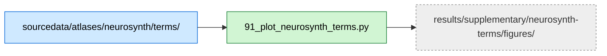

# Neurosynth Term Visualization

## Overview

This supplementary analysis provides visualization of the seven Neurosynth cognitive term maps used in the meta-analytic correlation analyses. Terms were selected *a priori* for their relevance to chess expertise and cognitive expertise more broadly. Visualizations include flatmaps, glass brains, and statistical summaries to document the spatial distribution of each term across the cortex.

## Required bundles

- `91_plot_neurosynth_terms.py` reads the Neurosynth term maps shipped in the core bundle → needs **A** (core) only.

## Data flow



## Methods

### Term Selection Rationale

Seven cognitive terms were selected based on theoretical relevance to chess expertise:

1. **Working memory**: Proxy for frontoparietal multiple-demand network; efficient information storage and manipulation in expert performance
2. **Memory retrieval**: Expert-specific mechanisms for efficient information access
3. **Navigation**: Spatial systems processing complex board configurations (established in chess research)
4. **Language**: Verbal and propositional reasoning, thought to be more prominent in novices
5. **Face recognition**: Evidence implicating fusiform cortex/FFA in expertise-related visual processing
6. **Early visual**: Assessment of reliance on low-level visual features
7. **Object recognition**: Shape-based processing and perceptual expertise in fine-grained discrimination

### Term Map Processing

**Source**: Downloaded z-scored association test maps from Neurosynth database
**Preprocessing**:
- Resampled to target resolution using nearest-neighbor interpolation
- Restricted to gray matter (ICBM152 2009c probabilistic template thresholded at >0.5)
- Gray matter mask includes cortical and subcortical regions

### Visualization Approaches

1. **Flatmaps**: Project term maps onto cortical surface for comprehensive visualization
2. **Glass brains**: Transparent brain overlays showing spatial extent
3. **Statistical summaries**: Peak coordinates, cluster sizes, and z-score distributions

## Dependencies

- Python 3.8+
- numpy, pandas
- nilearn (for surface projection and glass brain plots)
- matplotlib, seaborn (for plotting)

See `requirements.txt` in the repository root for complete dependencies.

## Data Requirements

### Input Files

- **Neurosynth term maps**: `BIDS/sourcedata/atlases/neurosynth/terms/*.nii.gz`
  - Z-scored association test maps for each term
  - Downloaded from https://neurosynth.org/

### Data Location

Path is derived from `CONFIG['NEUROSYNTH_ROOT']` in `common/constants.py`, which points at `BIDS/sourcedata/atlases/neurosynth/`.

## Running the Analysis

### Step 1: Generate Term Visualizations

```bash
# From repository root
python chess-supplementary/neurosynth-terms/91_plot_neurosynth_terms.py
```

**Outputs** (saved to `results/supplementary/neurosynth-terms/figures/`):
- Flatmap visualizations for each term
- Glass brain projections for each term
- Combined multi-panel figure showing all terms

**Expected runtime**: ~2-5 minutes (depends on surface projection)

## Key Results

**Spatial distributions**: Visualizations document where each cognitive function is most strongly represented across the brain
**Term differentiation**: Shows which terms have overlapping vs distinct spatial patterns
**Context for correlations**: Provides spatial context for interpreting meta-analytic correlation results from `chess-neurosynth/`

## File Structure

```
chess-supplementary/neurosynth-terms/
├── README.md                              # This file
├── 91_plot_neurosynth_terms.py            # Term map visualization
├── METHODS.md                             # Detailed methods from manuscript
└── DISCREPANCIES.md                       # Notes on analysis discrepancies
```

Outputs are written to the unified repo results tree at
`results/supplementary/neurosynth-terms/figures/`.

## Troubleshooting

**"FileNotFoundError: Neurosynth terms directory not found"**
- The core bundle (A) ships the term maps under `BIDS/sourcedata/atlases/neurosynth/terms/`; make sure bundle A has been extracted into the BIDS root.
- Verify `CONFIG['NEUROSYNTH_ROOT']` in `common/constants.py` points at your BIDS sourcedata folder.

**"Term map resolution mismatch"**
- Script handles resampling automatically
- Ensure term maps are in standard MNI space
