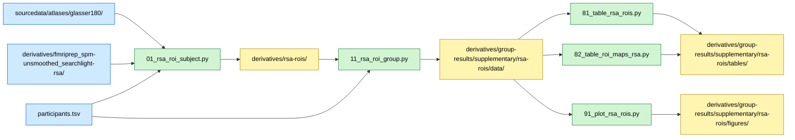

# RSA Searchlight ROI Summary (Glasser-180)

## Overview

This supplementary analysis summarizes whole-brain RSA searchlight correlation maps within the 180 bilateral Glasser cortical ROIs and performs expert vs. novice group comparisons per ROI. Three model RDMs are analyzed: Visual Similarity, Strategy, and Checkmate. Each ROI is bilateral, averaging left and right hemisphere voxels.

## Required bundles

- `01_rsa_roi_subject.py` reads the per-subject searchlight r-maps from `derivatives/fmriprep_spm-unsmoothed_searchlight-rsa/` and the Glasser-180 atlas from `sourcedata/atlases/glasser180/`, and writes per-subject ROI means into `derivatives/rsa-rois/` → needs **A** (core) + **E** (analyses).
- `11_rsa_roi_group.py` reads per-subject ROI means from `derivatives/rsa-rois/` and writes group aggregates into `derivatives/group-results/supplementary/rsa-rois/data/`.
- `81/82/91` table and plot scripts only consume the outputs of `11` from the group-results derivative folder (no extra bundle).

## Data flow



## Methods

### Rationale

While searchlight RSA provides whole-brain voxelwise maps, ROI-level summaries facilitate anatomical interpretation and comparison with other analyses.

### Data Sources

**Participants**: N=40 (20 experts, 20 novices)
**Atlas**: Glasser-180 bilateral volumetric atlas (MNI152NLin2009cAsym space)
**Input**: Subject-level RSA searchlight correlation maps for three model RDMs:
- Visual Similarity
- Strategy
- Checkmate

### Procedure

1. Load Glasser-180 bilateral atlas and ROI metadata (180 ROIs)
2. For each subject and RSA target:
 - Load volumetric r-map from searchlight analysis
 - Extract mean correlation across voxels within each of 180 bilateral ROIs using NiftiLabelsMasker
3. For each target:
 - Form expert and novice matrices (subjects × 180 ROIs)
 - Run Welch's t-tests per ROI comparing expert vs novice means
 - Apply Benjamini-Hochberg FDR correction across 180 tests (α=0.05)
 - Compute per-group descriptive means and 95% CIs per ROI

### Statistical Tests

- **Welch two-sample t-test** (unequal variances) per ROI
- **FDR correction** (Benjamini-Hochberg) at α=0.05 across 180 ROIs
- **95% CIs** for group differences

## Data Requirements

### Input Files

- **RSA searchlight maps**: `BIDS/derivatives/fmriprep_spm-unsmoothed_searchlight-rsa/sub-*/sub-*_space-MNI152NLin2009cAsym_desc-<regressor>_stat-r_searchlight.nii.gz`
- **Atlas**: `BIDS/sourcedata/atlases/glasser180/tpl-MNI152NLin2009cAsym_res-02_atlas-Glasser2016_desc-180_bilateral_resampled.nii.gz`
- **ROI metadata**: `BIDS/sourcedata/atlases/glasser180/region_info.tsv`
- **Participant data**: `BIDS/participants.tsv`

### Data Location

Paths resolved automatically from `common/constants.py`:

```python
BIDS_RSA_SEARCHLIGHT = BIDS_DERIVATIVES / "fmriprep_spm-unsmoothed_searchlight-rsa"
ROI_GLASSER_180_ATLAS = ROI_GLASSER_180 / "tpl-MNI152NLin2009cAsym_res-02_atlas-Glasser2016_desc-180_bilateral_resampled.nii.gz"
```

## Running the Analysis

### Step 1: Per-subject ROI extraction

```bash
# From repository root
python chess-supplementary/rsa-rois/01_rsa_roi_subject.py
```

**Outputs** (saved to `BIDS/derivatives/rsa-rois/sub-*/`):
- Per-subject ROI mean correlation values per target

### Step 2: Group-level statistics

```bash
python chess-supplementary/rsa-rois/11_rsa_roi_group.py
```

**Outputs** (saved to `derivatives/group-results/supplementary/rsa-rois/data/`):
- `rsa_subject_roi_means_{target}.tsv`: Subject x ROI tables per target
- `rsa_group_stats.pkl`: Per-target Welch statistics and descriptives

### Step 3: Tables and figures

```bash
python chess-supplementary/rsa-rois/81_table_rsa_rois.py
python chess-supplementary/rsa-rois/82_table_roi_maps_rsa.py
python chess-supplementary/rsa-rois/91_plot_rsa_rois.py
```

- Tables → `derivatives/group-results/supplementary/rsa-rois/tables/`
- Figures → `derivatives/group-results/supplementary/rsa-rois/figures/`

**Expected runtime**: ~5-10 minutes

## Key Results

**Significant ROIs**: ROIs surviving FDR correction show reliable expertise-related differences in RSA correlations
**Spatial patterns**: Identify anatomical regions where model RDMs differentially predict neural geometry in experts vs novices

## File Structure

```
chess-supplementary/rsa-rois/
├── README.md # This file
├── 01_rsa_roi_subject.py # Subject-level: ROI extraction → derivatives/rsa-rois/
├── 11_rsa_roi_group.py # Group-level: statistics → derivatives/group-results/
├── 81_table_rsa_rois.py # Per-target summary table
├── 82_table_roi_maps_rsa.py # ROI table annotated with maps
├── 91_plot_rsa_rois.py # ROI-level figures
├── DISCREPANCIES.md # Notes on analysis discrepancies
└── analyses/rsa_rois/ # Shared analysis modules (in repo root analyses/ package)
 ├── __init__.py
 └── io.py # RSA map loading utilities
```

Outputs: per-subject data in `BIDS/derivatives/rsa-rois/`; group-level aggregates in `derivatives/group-results/supplementary/rsa-rois/{data,tables,figures}/`. The `results/` tree contains **only group-level aggregates** (GDPR-compliant).
