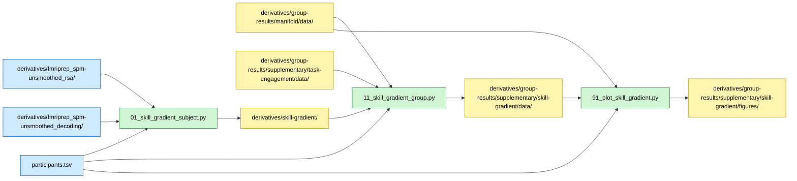

# Skill Gradient Analysis

## Overview

This analysis tests whether neural measures (RSA model fit, decoding accuracy,
participation ratio) scale continuously with chess skill, rather than differing
only as a binary expert-vs-novice group split. Two complementary skill proxies
are used:

1. **Elo rating** (general chess strength): Correlated with neural metrics
 within the expert group (n=20, Elo 1751--2269).
2. **Familiarisation accuracy** (stimulus-specific competence): Move accuracy
 on the 20 checkmate boards used in fMRI, correlated with neural metrics
 across all participants (n=38) and within experts only.

## Required bundles

- `01_skill_gradient_subject.py` reads per-subject RSA TSVs from `derivatives/fmriprep_spm-unsmoothed_rsa/` and decoding TSVs from `derivatives/fmriprep_spm-unsmoothed_decoding/`, and writes per-subject skill-gradient features into `derivatives/skill-gradient/` → needs **A** (core) + **E** (analyses).
- `11_skill_gradient_group.py` reads per-subject features from `derivatives/skill-gradient/`, the manifold group aggregate, and the familiarisation-accuracy aggregate from the group-results derivative folder, and writes group-level correlations into `derivatives/group-results/supplementary/skill-gradient/data/`.
- `91_plot_skill_gradient.py` consumes the outputs of `11` from the group-results derivative folder.

## Data flow



## Methods

### Rationale

A reviewer requested evidence that neural differences reflect a continuous
skill gradient, not just an artefact of the binary group partition. If neural
representations truly track chess expertise, they should correlate with
continuous skill measures within and across groups.

### Data Sources

**Participants**: N=40 (20 experts, 20 novices)
**Skill proxies**:
- Elo rating from BIDS `participants.tsv` (experts only, n=20)
- Familiarisation accuracy from pre-scan checkmate detection task (all participants, n=38)

**Neural measures**:
- RSA model fit (checkmate, strategy) from `derivatives/fmriprep_spm-unsmoothed_rsa/`
- SVM decoding accuracy (checkmate, strategy) from `derivatives/fmriprep_spm-unsmoothed_decoding/`
- Participation ratio (PR) from the chess-manifold group aggregate in `derivatives/group-results/manifold/data/`

### Correlation Procedure

For each skill proxy, Pearson and Spearman correlations are computed between
per-subject skill scores and per-subject neural measures (mean across 22
coarsened bilateral Glasser ROI groups). Correlations are also computed per
ROI. FDR correction (Benjamini-Hochberg) is applied across ROIs within each
measure.

**Note on pooled vs expert-only correlations**: Pooled (all participants)
correlations include between-group variance, so strong effects may partly
reflect the group split. Expert-only correlations isolate the within-group
skill gradient.

### Elo Correlations (Experts Only)

- Elo x Participation Ratio (PR): 22 ROIs + mean
- Elo x RSA model fit (checkmate, strategy): 22 ROIs + mean per model
- Elo x Decoding accuracy (checkmate, strategy): 22 ROIs + mean per target

### Familiarisation Correlations (All Participants + Experts Only)

- Move accuracy x PR, RSA (checkmate, strategy, visual similarity),
 Decoding (checkmate, strategy)
- Tested in both the full sample (n=38) and within experts (n=19)
- FDR correction applied across neural metrics within each sample

## Dependencies

- Python 3.9+ with packages: numpy, pandas, scipy, matplotlib
- Common utilities from `common/` (stats_utils, logging_utils, script_utils, plotting)

## Data Requirements

### Input Files

- **Participant metadata**: `BIDS/participants.tsv` (Elo in `rating` column)
- **Participation ratio**: `derivatives/group-results/manifold/data/pr_results.pkl` (from chess-manifold group aggregate)
- **RSA per-subject results**: `BIDS/derivatives/fmriprep_spm-unsmoothed_rsa/sub-XX/sub-XX_space-MNI152NLin2009cAsym_roi-glasser_stat-r_rsa.tsv`
- **Decoding per-subject results**: `BIDS/derivatives/fmriprep_spm-unsmoothed_decoding/sub-XX/sub-XX_space-MNI152NLin2009cAsym_roi-glasser_stat-accuracy_decoding.tsv`
- **Familiarisation accuracy**: `derivatives/group-results/supplementary/task-engagement/data/familiarisation_subject_accuracy.csv`

### Data Location

Configure the external data root in `common/constants.py`:

```python
# Base folder containing BIDS/ (all data lives inside BIDS/)
_EXTERNAL_DATA_ROOT = Path("/path/to/manuscript-data")
```

## Running the Analysis

### Step 1: Per-subject feature assembly

```bash
cd chess-supplementary/skill-gradient
python 01_skill_gradient_subject.py
```

Extracts per-subject neural metrics (RSA, decoding, PR) and writes them to `BIDS/derivatives/skill-gradient/`.

### Step 2: Group-level skill gradient correlations

```bash
python 11_skill_gradient_group.py
```

Computes Elo and familiarisation correlations with all neural metrics (RSA, decoding, PR) at the mean and per-ROI level, with FDR correction.
Outputs to `derivatives/group-results/supplementary/skill-gradient/data/`.

### Step 3: Generate skill gradient figures

```bash
python 91_plot_skill_gradient.py
```

Produces the combined 3x3 panel: Elo correlations (row 1, experts only) and familiarisation correlations (rows 2--3, all participants and experts only).
Outputs to `derivatives/group-results/supplementary/skill-gradient/figures/`.

## Key Results

### Elo Correlations

No ROI-level correlations survive FDR correction for any measure. The
strongest uncorrected effects:

- **RSA checkmate (mean)**: r=0.465, p=0.039 -- higher Elo associated with
 stronger checkmate model fit (experts only)
- **RSA strategy (mean)**: r=0.366, p=0.113

PR and decoding show no reliable Elo gradient (all p>0.25 at the mean level).

### Familiarisation Correlations

**All participants (n=38)**: Several strong correlations with move accuracy,
reflecting both within- and between-group variance:

- Decoding checkmate: r=0.709, p<0.001
- RSA strategy: r=0.588, p<0.001
- Decoding strategy: r=0.541, p<0.001
- RSA checkmate: r=0.441, p=0.006
- PR: r=-0.394, p=0.014

**Experts only (n=19)**: No correlation reaches significance, consistent with
range restriction within the expert group.

## File Structure

```
chess-supplementary/skill-gradient/
├── 01_skill_gradient_subject.py # Subject-level: per-subject neural metrics → derivatives/skill-gradient/
├── 11_skill_gradient_group.py # Group-level: Elo and familiarisation correlations → derivatives/group-results/
├── 91_plot_skill_gradient.py # Combined 3x3 figure: Elo (row 1) + familiarisation (rows 2-3)
└── README.md
```

Outputs: per-subject data in `BIDS/derivatives/skill-gradient/`; group-level aggregates in `derivatives/group-results/supplementary/skill-gradient/{data,figures}/`. The `results/` tree contains **only group-level aggregates** (GDPR-compliant).
