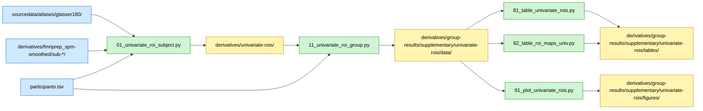

# Univariate ROI Summary (Glasser-180)

## Overview

This supplementary analysis summarizes subject-level univariate contrast maps within the 180 bilateral Glasser cortical ROIs and performs expert vs. novice group comparisons per ROI. Two first-level contrasts are analyzed: (1) Checkmate > Non-checkmate, and (2) All > Rest. Each ROI is bilateral, averaging left and right hemisphere voxels.

## Required bundles

- `01_univariate_roi_subject.py` reads subject-level SPM contrast images from `derivatives/fmriprep_spm-smoothed/sub-*/exp/` and the Glasser-180 atlas from `sourcedata/atlases/glasser180/`, and writes per-subject ROI means into `derivatives/univariate-rois/` → needs **A** (core) + **D** (spm).
- `11_univariate_roi_group.py` reads per-subject ROI means from `derivatives/univariate-rois/` and writes group aggregates into `derivatives/group-results/supplementary/univariate-rois/data/`.
- `81/82/91` table and plot scripts only consume the outputs of `11` from the group-results derivative folder (no extra bundle).

## Data flow



## Methods

### Rationale

While whole-brain SPM analyses provide voxelwise statistical maps, ROI-level summaries facilitate anatomical interpretation and comparison with multivariate analyses.

### Data Sources

**Participants**: N=40 (20 experts, 20 novices)
**Atlas**: Glasser-180 bilateral volumetric atlas (MNI152NLin2009cAsym space)
**Input**: Subject-level first-level SPM contrast images (smoothed 4mm FWHM):
- con_0001: Checkmate > Non-checkmate
- con_0002: All > Rest

### Procedure

1. Load Glasser-180 bilateral atlas and ROI metadata (180 ROIs)
2. For each subject and contrast:
 - Load volumetric contrast image from SPM first-level analysis
 - Extract mean contrast value across voxels within each of 180 bilateral ROIs using NiftiLabelsMasker
3. For each contrast:
 - Form expert and novice matrices (subjects × 180 ROIs)
 - Run Welch's t-tests per ROI comparing expert vs novice means
 - Apply Benjamini-Hochberg FDR correction across 180 tests (α=0.05)
 - Compute per-group descriptive means and 95% CIs per ROI

### Statistical Tests

- **Welch two-sample t-test** (unequal variances) per ROI
- **FDR correction** (Benjamini-Hochberg) at α=0.05 across 180 ROIs
- **95% CIs** for group differences

## Dependencies

- Python 3.8+
- numpy, pandas, scipy
- nilearn (NiftiLabelsMasker for ROI extraction)
- statsmodels (for FDR correction)

See `requirements.txt` in the repository root for complete dependencies.

## Data Requirements

### Input Files

- **SPM contrast images**: `BIDS/derivatives/fmriprep_spm-smoothed/sub-*/exp/con_*.nii.gz`
- **Atlas**: `BIDS/sourcedata/atlases/glasser180/tpl-MNI152NLin2009cAsym_res-02_atlas-Glasser2016_desc-180_bilateral_resampled.nii.gz`
- **ROI metadata**: `BIDS/sourcedata/atlases/glasser180/region_info.tsv`
- **Participant data**: `BIDS/participants.tsv`

### Data Location

Paths resolved automatically from `common/constants.py`:

```python
SPM_GLM_SMOOTH4 = BIDS_DERIVATIVES / "fmriprep_spm-smoothed"
ROI_GLASSER_180_ATLAS = ROI_GLASSER_180 / "tpl-MNI152NLin2009cAsym_res-02_atlas-Glasser2016_desc-180_bilateral_resampled.nii.gz"
```

## Running the Analysis

### Step 1: Per-subject ROI extraction

```bash
# From repository root
python chess-supplementary/univariate-rois/01_univariate_roi_subject.py
```

**Outputs** (saved to `BIDS/derivatives/univariate-rois/sub-*/`):
- Per-subject ROI mean contrast values per contrast

### Step 2: Group-level statistics

```bash
python chess-supplementary/univariate-rois/11_univariate_roi_group.py
```

**Outputs** (saved to `derivatives/group-results/supplementary/univariate-rois/data/`):
- `univ_subject_roi_means_{contrast}.tsv`: Subject x ROI tables per contrast
- `univ_group_stats.pkl`: Per-contrast Welch statistics and descriptives

### Step 3: Tables and figures

```bash
python chess-supplementary/univariate-rois/81_table_univariate_rois.py
python chess-supplementary/univariate-rois/82_table_roi_maps_univ.py
python chess-supplementary/univariate-rois/91_plot_univariate_rois.py
```

- Tables → `derivatives/group-results/supplementary/univariate-rois/tables/`
- Figures → `derivatives/group-results/supplementary/univariate-rois/figures/`

**Expected runtime**: ~2-5 minutes

## Key Results

**Significant ROIs**: ROIs surviving FDR correction show reliable expertise-related differences in univariate activations
**Spatial patterns**: Identify anatomical regions where experts and novices differ in task-related activations

## File Structure

```
chess-supplementary/univariate-rois/
├── README.md # This file
├── 01_univariate_roi_subject.py # Subject-level: ROI extraction → derivatives/univariate-rois/
├── 11_univariate_roi_group.py # Group-level: statistics → derivatives/group-results/
├── 81_table_univariate_rois.py # Summary table per contrast
├── 82_table_roi_maps_univ.py # ROI table annotated with maps
├── 91_plot_univariate_rois.py # ROI-level figures
├── DISCREPANCIES.md # Notes on analysis discrepancies
└── analyses/univariate_rois/ # Shared analysis modules (in repo root analyses/ package)
 ├── __init__.py
 └── io.py # Contrast map loading utilities
```

Outputs: per-subject data in `BIDS/derivatives/univariate-rois/`; group-level aggregates in `derivatives/group-results/supplementary/univariate-rois/{data,tables,figures}/`. The `results/` tree contains **only group-level aggregates** (GDPR-compliant).
